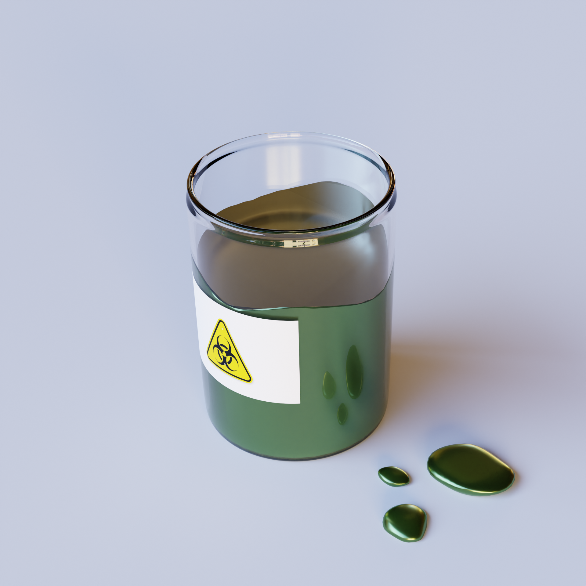
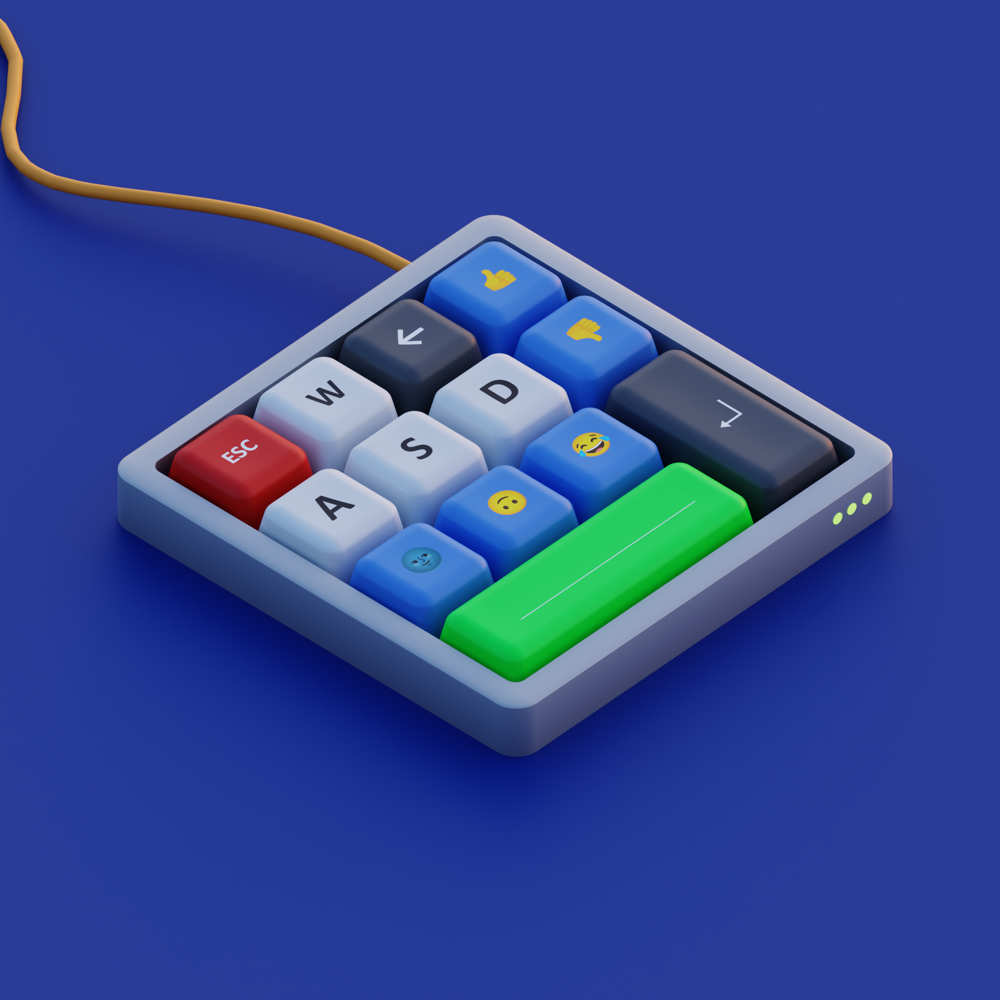
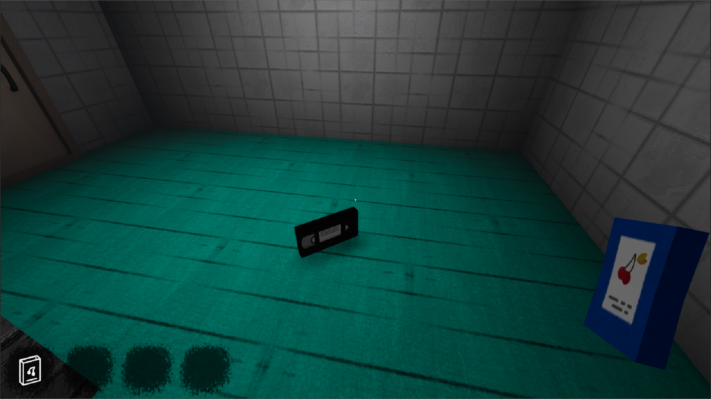
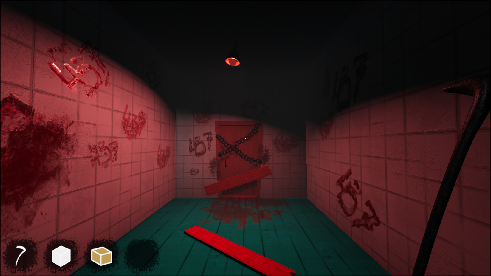
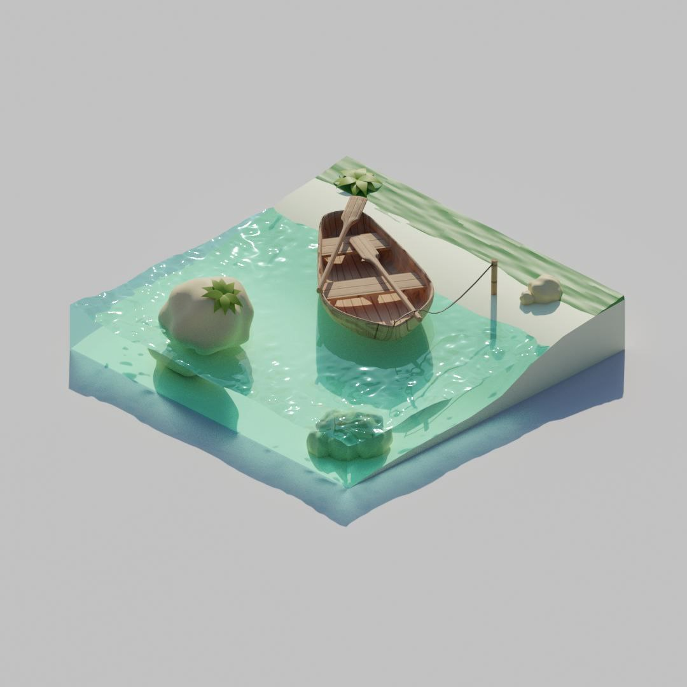

# Blender
### У меня есть несколько проектов, которые я могу показать :)
##### Вот недавние:

- [Модель на SketchFab]([https://sketchfab.com/3d-models/keyboard-4f775cf34aff443680a65c7061d9ebe7](https://sketchfab.com/3d-models/a-jar-with-a-dangerous-metallic-liquid-72e0458ae91c48079087c68565e874f1))

- [Модель на SketchFab](https://sketchfab.com/3d-models/keyboard-4f775cf34aff443680a65c7061d9ebe7)
##### Это модельки из моего последнего pet-проекта. Они в cartoon стиле

Ссылки:
- [Здание для уровня, двери, картины, камеры, доски, лампы и лом, созданные в blender)](https://youtu.be/bIAdAnkS6GE)

##### 2-3 года назад я сделал модельку для души 

