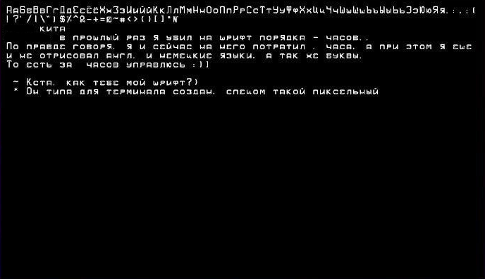
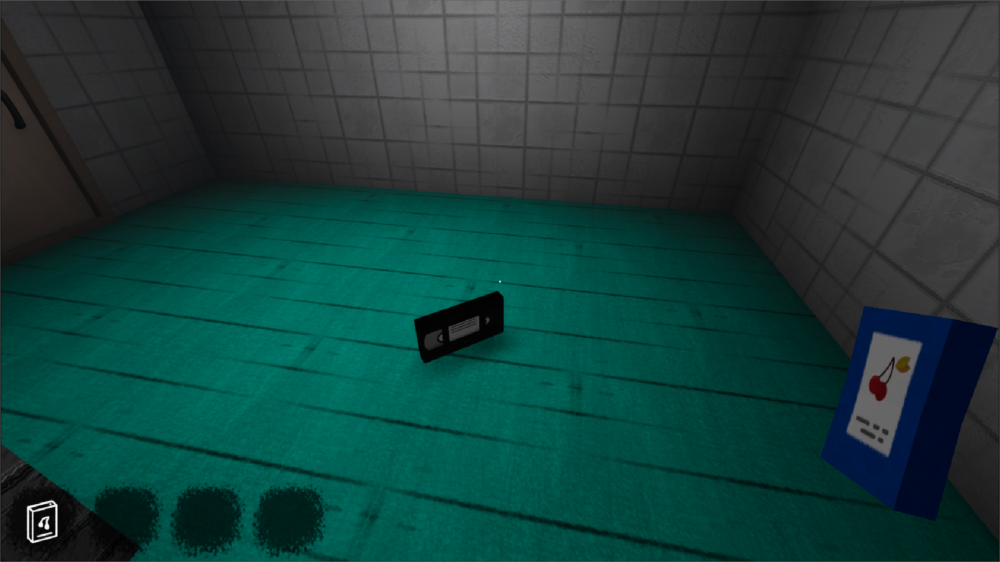
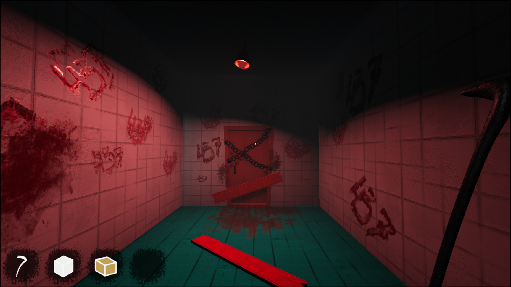
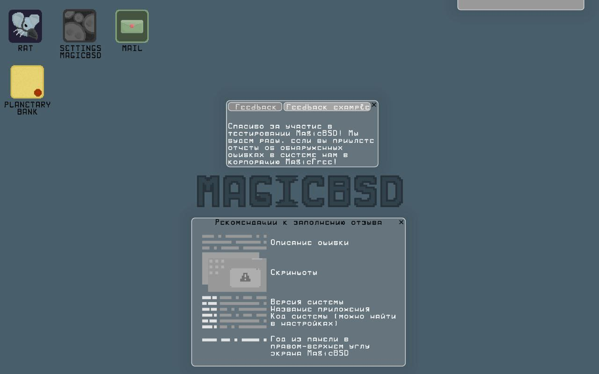
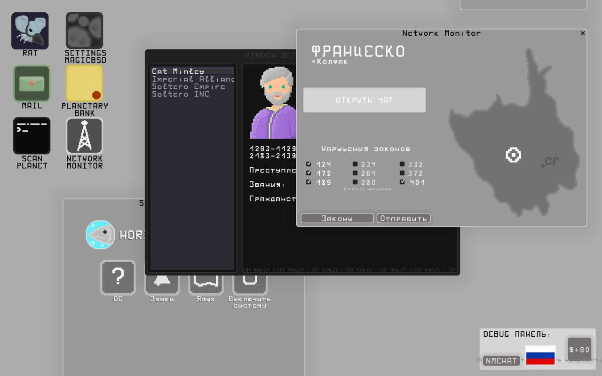

# GODOT 
### Я работал с Godot 3 и Godot 4

#### Продублирую ссылки на мои гайды. В них можно обнаружить код :)
- [Моё видео по сохранению прогресса в Godot](https://youtu.be/5NgE_IJVtmk)
- [Моё видео по локализации игры в Godot](https://youtu.be/yHgU3tU0Nw0)

#### Еще найти код можно тут:
- [Код закрытия игры](https://github.com/horityfoxy/resume/blob/main/Godot/Script1.gd)
- [Код открытия двери, которая закрыта доской (взаимодействие предмета из инвентаря, доски и двери)](https://github.com/horityfoxy/resume/blob/main/Godot/Script2.gd)
---
##### Это я создал растровый шрифт для своего pet-проекта в Godot 3

---
#### Мои проекты:
##### Моя основная 3D инди-игра в cartoon стиле. В игре присутствует глубочайший сюжет, который я писал более 6 лет. Все текстуры и модели были созданы мной.

Ссылки:
- [Демонстрация основных механик (но далеко не всех задуманных)](https://youtu.be/bIAdAnkS6GE)
- [Видео с дверью в комнату вокруг которой строится основная линия первой части игры](https://youtu.be/7nY5gCSQ9DU)

##### Моя прошлая инди-игра в стиле операционной системы. Главное преимущество в этой игре по моему мнению в том, что погрузить игрока в игру будет легче простого, а также уникальность проекта.

Ссылки:
- [Демонстрация игрового процесса 1 уровня (без обновления системы, то есть перехода на другой уровень)](https://youtu.be/OSPpyDIMBlI)

##### Еще один проект. К сожалению, он не сохранился от слова совсем. Только видео pre-alpha игры. Идея игры в том, что игрок в роли императора управляет империей (что-то вроде Reigns только с более глубоким сюжетом). В отличии от Reigns игрок может попробовать обойти правила игры и "взломать ее", выйдя за рамки игрового процесса.
Ссылки:
- [Демонстрация игрового процесса игры](https://youtu.be/almF3b327I0)
